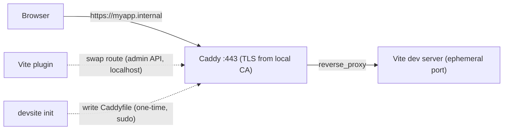

# devsite

One project = one stable `https://<name>.internal` URL. No port numbers, no port coordination between projects, HTTPS everywhere — and the same URL works on your phone over Tailscale. Any number of projects run simultaneously.

With a stock dev server, a project's address is a port number. `localhost:3000` is taken, so this project runs on 3001 — on this machine, today; another machine or a restarted server can pick a different number. Testing on a phone requires the machine's LAN IP, and browser APIs that require a secure context (camera, clipboard, service workers) do not work over plain HTTP. devsite gives each project a fixed name instead of a port.

<!-- TODO: demo GIF — ~20 s screen recording: `devsite init` → `bun dev` → https://myapp.internal opens on the desktop → the same URL opens on a phone. -->

> **Status:** pre-1.0, being extracted from two working projects. The API may still move.

## How it works

A `devSite` field in `package.json` declares a host. There is no port field:

```jsonc
// package.json
{
  "name": "myapp",
  "devSite": { "host": "myapp.internal" }
}
```

devsite has two parts:

- **`devsite init`** — a one-time, per-machine bootstrap. It collects every `devSite` host in the repo, writes one file per host into `devsite.d/` next to the machine-global Caddyfile (each a TLS-enabled block answering `503` as a placeholder), and (re)starts Caddy as an always-on service. Your Caddyfile itself is set up once — a single `import devsite.d/*.caddy # devsite` line plus devsite's two global directives — and never rewritten after that: the import glob covers every future host file, so your own Caddyfile content and devsite's writes can never conflict, and each repo's `init` only ever touches its own files. This is the only step that asks for `sudo`.
- **The Vite plugin** — runs on every `bun dev`. It picks a free ephemeral port, points Vite's server and HMR at it, and swaps the host's placeholder route for a live `reverse_proxy` through Caddy's admin API on localhost. This step needs no sudo, and because every port is picked at start time, no two projects can want the same one.



The live route exists only in Caddy's running config. If the Caddy service restarts mid-session, the host reverts to the `503` placeholder until you restart the dev server.

## Quick start

Setup has two tiers. The first is complete on its own: after it, the URL works on this machine. The second extends the same URL to your other devices.

> Current limitation: the paths assume Caddy from Homebrew on Apple Silicon macOS (`/opt/homebrew/etc/Caddyfile`, `brew services`). See [Requirements](#requirements).

### Step 1 — local only (~5 minutes)

1. **Install Caddy:**

   ```sh
   brew install caddy
   ```

2. **Declare a host** in your project's `package.json`:

   ```jsonc
   "devSite": { "host": "myapp.internal" }
   ```

3. **Make `.internal` names resolve to your machine.** `devsite init` verifies this but does not yet configure it for you. Two options:

   Option A — one hosts entry per project:

   ```sh
   echo "127.0.0.1 myapp.internal" | sudo tee -a /etc/hosts
   ```

   Option B — a wildcard, so every current and future `*.internal` host resolves without further changes. dnsmasq plus a resolver stub:

   ```sh
   brew install dnsmasq
   echo "address=/internal/127.0.0.1" >> /opt/homebrew/etc/dnsmasq.conf
   sudo brew services restart dnsmasq
   sudo mkdir -p /etc/resolver
   echo "nameserver 127.0.0.1" | sudo tee /etc/resolver/internal
   ```

   *What this changed:* macOS now sends `*.internal` DNS queries to your local dnsmasq (via `/etc/resolver/internal`), which answers with `127.0.0.1`.

4. **Run the bootstrap** from the repo root:

   ```sh
   devsite init            # or: devsite init --dry-run to preview
   ```

   *What this changed:* wrote your host's file into `/opt/homebrew/etc/devsite.d/`, and set up `/opt/homebrew/etc/Caddyfile` once — one `import devsite.d/*.caddy` line, plus a global options block pinning certificate storage and enabling `local_certs` (added into your own block if you had one; an existing Caddyfile is backed up to `Caddyfile.bak` first; the very first run also saves `Caddyfile.pre-devsite`, which is never touched again), restarted Caddy as a `brew services` background service, pinned Caddy's certificate storage to `~/Library/Application Support/Caddy`, and ran `sudo caddy trust` to add Caddy's local CA root to your system trust store — that's the whole certificate-trust step for this machine. It ends with a verification report (TLS answering, cert chain, DNS) so you can see what works before opening a browser. Every write shows a full diff and asks for confirmation first; `--dry-run` prints the same diff and writes nothing.

5. **Add the plugin** to your Vite config:

   ```ts
   // vite.config.ts
   import { devsite } from "@den-ai/devsite/vite";

   export default defineConfig({
     plugins: [devsite()],
   });
   ```

6. **Run dev and open the URL:**

   ```sh
   bun dev
   ```

   Open `https://myapp.internal`. The certificate is trusted, and HMR runs over `wss`.

Each additional project needs only steps 2 and 5 plus a re-run of `devsite init`. Because no project declares a port, projects never coordinate with each other and any number can run at once.

### Step 2 — your other devices (optional)

This is the most manual part of the tool: two steps that cannot be automated, each done once per device.

1. **Install [Tailscale](https://tailscale.com)** on this machine and on the device.

2. **Point the tailnet's DNS for `internal` at this machine.** In the Tailscale admin console → DNS → add a split-DNS nameserver: domain `internal` → this machine's Tailscale IP (`tailscale ip -4`). Your local dnsmasq must answer on that IP with that IP, so replace the loopback config from step 1.3 with:

   ```
   # /opt/homebrew/etc/dnsmasq.conf
   address=/internal/<your-tailscale-ip>
   listen-address=127.0.0.1,<your-tailscale-ip>
   ```

   and `sudo brew services restart dnsmasq`. (Your own machine keeps working — it now resolves `*.internal` to its Tailscale IP, where the same Caddy answers.)

3. **Trust the CA root on the device.** The root certificate is at:

   ```
   ~/Library/Application Support/Caddy/pki/authorities/local/root.crt
   ```

   Get it onto the phone (AirDrop works) and install it. On iOS, installing is not trusting: install the profile, then Settings → General → About → Certificate Trust Settings → toggle it on.

The same URL now works on the phone, including HMR. `devsite init` re-checks this path on every run (Tailscale up, DNS answering on the Tailscale IP) and prints the per-device checklist.

## DNS and certificates

**How does `*.internal` resolve?** `.internal` is the TLD ICANN reserved for private use: no public DNS answers for it, and no public CA issues certificates for it. Resolution is provided locally — via `/etc/hosts` or dnsmasq for this machine (step 1.3), and via Tailscale split DNS pointing at that dnsmasq for other devices (step 2.2).

**Why does the browser trust the certificate?** Caddy generates a local certificate authority and issues short-lived certificates for your hosts from it. `devsite init` trusts that CA's root on your machine (`sudo caddy trust`) and pins the CA's storage to one fixed path, so the CA stays identical no matter how Caddy is run — a device that trusted the root once keeps trusting every certificate it issues. Other devices trust the same root file manually (step 2.3).

## Why not X

- **[portless](https://github.com/typicode/portless) / devurl** — solve the same problem with `*.localhost` URLs. They need no DNS setup, because browsers resolve `.localhost` to loopback on their own — but loopback also means no other device can reach the URL. devsite requires more one-time setup (Caddy, a local CA, DNS); in return the URL carries a trusted certificate and works from other devices.
- **Laravel Valet / Herd** — the same per-project local HTTPS domain experience, built for the PHP ecosystem on macOS. devsite is a framework-agnostic version of the same idea for Vite projects.
- **A hand-written Caddyfile** — provides the same URLs, but every project needs a fixed port and every repo edits the shared file by hand. devsite adds route self-registration (each repo's `init` writes its own `devsite.d/` files and never touches another's) and removes fixed ports (ephemeral port plus admin-API swap at dev time).

## What devsite changes on your machine, and how to undo it

devsite modifies machine-global state. This section lists every change and how to remove it.

What `devsite init` changes (it prints every privileged command as it runs it):

- `/opt/homebrew/etc/Caddyfile` — set up once, then never rewritten: one `import devsite.d/*.caddy # devsite` line, and Caddy's global options block gets devsite's two directives (`storage` pin, `local_certs`) — added into your block if you have one, or as a new block if you don't. Later runs only check the directives are present; a block you own is never rewritten. Before any Caddyfile write, the previous file is copied to `Caddyfile.bak`; the very first write also saves `Caddyfile.pre-devsite`, which no later run touches.
- `/opt/homebrew/etc/devsite.d/` — devsite's own directory: one `<host>.caddy` file per host (first line `# <project>`, recording which project owns it). Registering, changing, or renaming hosts only writes files here.
- The Caddy Homebrew service — restarted, and left running in the background.
- `~/Library/Application Support/Caddy` — Caddy's certificate storage, pinned here.
- Your system trust store — Caddy's local CA root is added via `sudo caddy trust`.

What the Vite plugin changes: it edits Caddy's in-memory running config over the localhost admin API, and it records the host's last-used date in `~/Library/Application Support/devsite/last-used.json` on every dev-server start (advisory data for a future `clean`/`doctor`; `DEVSITE_STATE_DIR` overrides the directory).

**Undoing it** — there is no `devsite uninstall` command yet, so removal is manual:

```sh
sudo caddy untrust                      # remove the CA root from the trust store
sudo brew services stop caddy           # stop the background service
sudo rm -rf /opt/homebrew/etc/devsite.d # devsite's own directory
sudo rm /opt/homebrew/etc/Caddyfile     # or remove the import line + devsite's global directives / restore Caddyfile.pre-devsite
rm -rf ~/Library/Application\ Support/Caddy
rm -rf ~/Library/Application\ Support/devsite # last-used dates (Vite plugin)
sudo rm /etc/resolver/internal          # plus the dnsmasq config, if you set them up
```

Note: **renaming** a host (changing a project's `devSite.host`) cleans up after itself — the next `devsite init` in that project deletes the old host's file. **Deleting a whole project** does not: its host file lingers in `devsite.d/` (serving a `503`) until you remove it by hand — `devsite init` cannot tell an abandoned project from one that simply is not this repo.

## Upgrading from an older devsite (pre-`devsite.d`)

Older devsite versions kept their rendered config inside the Caddyfile itself — first as plain blocks, then as a marker-delimited region. The first `devsite init` from the current version migrates the whole file in one confirmed run: your own content stays in the Caddyfile, devsite's blocks (other repos' included, byte-for-byte) move into `devsite.d/`, and the old markers disappear.

One hazard remains, by design: devsite cannot stop an **older installed copy** from writing the old format again. If a not-yet-upgraded project runs its old `devsite init` after the migration, it re-adds a managed region — whose global options block duplicates the one already in your Caddyfile — and Caddy's restart fails. Recovery is one command: re-run the **new** `devsite init` (the migration self-heals), or restore `Caddyfile.bak`. The rule: after the first post-upgrade `init` on a machine, upgrade devsite in a project before running `init` there. (An old project's `bun dev` is unaffected — it only talks to Caddy's admin API.)

## Requirements

- **Node.js ≥ 22** — the published CLI runs under plain Node (`npx devsite init` works without bun). Developing the repo itself still uses bun.
- **Caddy ≥ 2**, installed through Homebrew (`devsite init` manages it with `brew services`).
- **Vite** — the plugin is developed against Vite 8.
- **macOS on Apple Silicon**, currently. The Homebrew prefix `/opt/homebrew` and macOS paths are hardcoded; supporting Linux or Intel Macs requires making them configurable, which has not been done yet. Windows is out of scope.
- **Project layout**: `devsite init` reads `devSite` fields from the repo root `package.json` and, in a monorepo, from `apps/*/package.json` and `packages/*/package.json`. Other workspace folders (e.g. `services/*`) are not scanned yet.
- **Tailscale** — optional, only for the other-devices tier.
