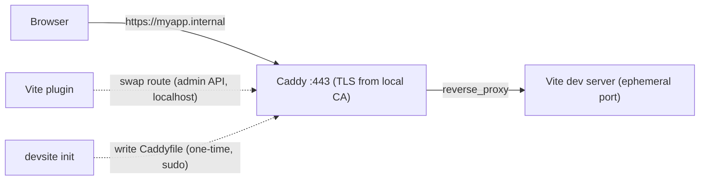

# devsite

One project = one stable `https://<name>.internal` URL. No port numbers, no port coordination between projects, HTTPS everywhere — and the same URL works on your phone over Tailscale. Any number of projects run simultaneously.

You know the problem: `localhost:3000` is taken, again. Ports drift between projects and between machines. Vite prints a different port than it did yesterday. Testing on your phone means hunting for your LAN IP, and then HTTPS-only APIs (camera, clipboard, service workers) don't work anyway. devsite replaces all of that with one name per project that never changes.

<!-- TODO: demo GIF — ~20 s screen recording: `devsite init` → `bun dev` → https://myapp.internal opens on the desktop → the same URL opens on a phone. -->

> **Status:** pre-1.0, being extracted from two working projects. Not yet published to npm, and the API may still move. The commands below show the intended published usage.

## How it works

A `devSite` field in `package.json` declares a host — and nothing else. There is no port anywhere in your config:

```jsonc
// package.json
{
  "name": "myapp",
  "devSite": { "host": "myapp.internal" }
}
```

Two halves make that host work:

- **`devsite init`** — a one-time, per-machine bootstrap. It collects every `devSite` host in the repo, writes the machine-global Caddyfile (one TLS-enabled block per host, each answering `503` as a placeholder), and (re)starts Caddy as an always-on service. Blocks registered by your other repos are preserved verbatim, so repos never fight over the shared file. This is the only step that asks for `sudo`.
- **The Vite plugin** — runs every `bun dev`. It picks a free ephemeral port, points Vite's server and HMR at it, and swaps the host's placeholder route for a live `reverse_proxy` through Caddy's admin API on localhost. No sudo, no configured ports — which is why any number of projects can run at once.



One thing to know: the live route exists only in Caddy's running config. If the Caddy service restarts mid-session, the host reverts to the `503` placeholder until you restart the dev server.

## Quick start

Two tiers. The first is complete on its own — stop there and you have a fully working tool on your machine. The second extends the same URL to your other devices.

> Current shape of the code, stated honestly: `devsite init` discovers projects in a monorepo layout (workspaces under `apps/*` and `packages/*`), and its paths assume Caddy from Homebrew on Apple Silicon macOS (`/opt/homebrew/etc/Caddyfile`, `brew services`). See [Requirements](#requirements).

### Step 1 — local only (~5 minutes)

1. **Install Caddy:**

   ```sh
   brew install caddy
   ```

2. **Declare a host** in your project's `package.json`:

   ```jsonc
   "devSite": { "host": "myapp.internal" }
   ```

3. **Make `.internal` names resolve to your machine.** `devsite init` verifies this but does not yet configure it for you. Two options:

   The quick one — a hosts entry per project:

   ```sh
   echo "127.0.0.1 myapp.internal" | sudo tee -a /etc/hosts
   ```

   Or the wildcard one, so every future `*.internal` host resolves with zero extra steps — dnsmasq plus a resolver stub:

   ```sh
   brew install dnsmasq
   echo "address=/internal/127.0.0.1" >> /opt/homebrew/etc/dnsmasq.conf
   sudo brew services restart dnsmasq
   sudo mkdir -p /etc/resolver
   echo "nameserver 127.0.0.1" | sudo tee /etc/resolver/internal
   ```

   *What this changed:* macOS now sends `*.internal` DNS queries to your local dnsmasq (via `/etc/resolver/internal`), which answers with `127.0.0.1`.

4. **Run the bootstrap** from the repo root:

   ```sh
   devsite init            # or: devsite init --dry-run to preview
   ```

   *What this changed:* wrote `/opt/homebrew/etc/Caddyfile` (an existing one is backed up to `Caddyfile.bak`), restarted Caddy as a `brew services` background service, pinned Caddy's certificate storage to `~/Library/Application Support/Caddy`, and ran `sudo caddy trust` to add Caddy's local CA root to your system trust store — that's the whole certificate-trust step for this machine. It ends with a verification report (TLS answering, cert chain, DNS) so you can see what works before opening a browser.

5. **Add the plugin** to your Vite config:

   ```ts
   // vite.config.ts
   import { devsite } from "@dendotai/devsite/vite";

   export default defineConfig({
     plugins: [devsite()],
   });
   ```

6. **Run dev and open the URL:**

   ```sh
   bun dev
   ```

   Open `https://myapp.internal`. Green lock, HMR over `wss`, no port in sight.

Your second, third, nth project needs only steps 2 and 5 plus a re-run of `devsite init` — no coordination with the projects already running. That is the port-less design paying off, not extra setup.

### Step 2 — your other devices (optional)

This is the fiddliest part of the whole tool — two manual, per-device steps that nothing can automate away. Budget a few more minutes and do them once per device.

1. **Install [Tailscale](https://tailscale.com)** on this machine and on the device.

2. **Point the tailnet's DNS for `internal` at this machine.** In the Tailscale admin console → DNS → add a split-DNS nameserver: domain `internal` → this machine's Tailscale IP (`tailscale ip -4`). Your local dnsmasq must answer on that IP with that IP, so replace the loopback config from step 1.3 with:

   ```
   # /opt/homebrew/etc/dnsmasq.conf
   address=/internal/<your-tailscale-ip>
   listen-address=127.0.0.1,<your-tailscale-ip>
   ```

   and `sudo brew services restart dnsmasq`. (Your own machine keeps working — it now resolves `*.internal` to its Tailscale IP, where the same Caddy answers.)

3. **Trust the CA root on the device.** The root certificate is at:

   ```
   ~/Library/Application Support/Caddy/pki/authorities/local/root.crt
   ```

   Get it onto the phone (AirDrop works) and install it. On iOS, installing is not trusting: install the profile, then Settings → General → About → Certificate Trust Settings → toggle it on.

Now `https://myapp.internal` on the phone is the same app, same URL, live HMR. `devsite init` re-checks this path on every run (Tailscale up, DNS answering on the Tailscale IP) and prints the per-device checklist.

## The DNS and certificate story

The two questions everyone asks:

**How does `*.internal` resolve?** It doesn't — by design. `.internal` is the TLD ICANN reserved for private use, so no public DNS will ever answer for it and no public CA will ever issue a certificate for it. You provide the answers yourself: locally via `/etc/hosts` or dnsmasq (step 1.3), and for other devices via Tailscale split DNS pointing at your dnsmasq (step 2.2).

**Why does the browser trust the certificate?** Caddy generates a local certificate authority and issues short-lived certificates for your hosts from it. `devsite init` trusts that CA's root on your machine (`sudo caddy trust`) and pins the CA's storage to one fixed path — so the CA stays identical no matter how Caddy is run, and a device that trusted the root once stays green. Other devices trust the same root file manually (step 2.3).

## Why not X

- **[portless](https://github.com/typicode/portless) / devurl** — the same no-more-ports itch, solved with `*.localhost` URLs. Their strength is zero DNS setup (browsers resolve `.localhost` to loopback on their own); the ceiling is that loopback is all you get — no other device can ever reach the URL. devsite pays a heavier one-time setup (Caddy, a local CA, DNS) and buys real TLS plus your phone in return.
- **Laravel Valet / Herd** — the same "every project gets a pretty HTTPS domain" experience, done very well, for the PHP ecosystem on macOS. devsite is a small, framework-agnostic take on that idea for Vite projects.
- **A hand-written Caddyfile** — where devsite started. It works, but every project needs a fixed port and every repo edits the shared file by hand. devsite adds the two missing pieces: repos register their own routes (`devsite init` preserves everyone else's), and fixed ports disappear entirely (ephemeral port + admin-API swap at dev time).

## Trust: what devsite touches, and how to undo it

devsite deliberately touches machine-global state, so here is the honest inventory.

What `devsite init` changes (it prints every privileged command as it runs it):

- `/opt/homebrew/etc/Caddyfile` — regenerated on every run; the previous file is copied to `Caddyfile.bak` first. Site blocks owned by other repos are detected and kept byte-for-byte; only this repo's hosts are rewritten.
- The Caddy Homebrew service — restarted, and left running in the background.
- `~/Library/Application Support/Caddy` — Caddy's certificate storage, pinned here.
- Your system trust store — Caddy's local CA root is added via `sudo caddy trust`.

What the Vite plugin changes: nothing on disk. It only edits Caddy's in-memory running config over the localhost admin API.

**Undoing it** — there is no `devsite uninstall` command yet, so the exit is manual:

```sh
sudo caddy untrust                      # remove the CA root from the trust store
sudo brew services stop caddy           # stop the background service
sudo rm /opt/homebrew/etc/Caddyfile     # or edit out just your blocks / restore Caddyfile.bak
rm -rf ~/Library/Application\ Support/Caddy
sudo rm /etc/resolver/internal          # plus the dnsmasq config, if you set them up
```

One gotcha to know: removing a `devSite` field and re-running `devsite init` does **not** remove that host's block — a host the current repo no longer owns is treated as another repo's and preserved. Delete retired blocks from the Caddyfile by hand.

## Requirements

- **Bun** — the CLI is TypeScript executed directly by Bun.
- **Caddy ≥ 2**, installed through Homebrew (`devsite init` manages it with `brew services`).
- **Vite** — the plugin is developed against Vite 8.
- **macOS on Apple Silicon**, currently. The Homebrew prefix `/opt/homebrew` and macOS paths are hardcoded today; Linux and Intel-Mac support means making those configurable, and hasn't been done yet. Windows is out of scope.
- **A monorepo layout**, currently: `devsite init` discovers `devSite` fields in `apps/*/package.json` and `packages/*/package.json`.
- **Tailscale** — optional, only for the other-devices tier.
